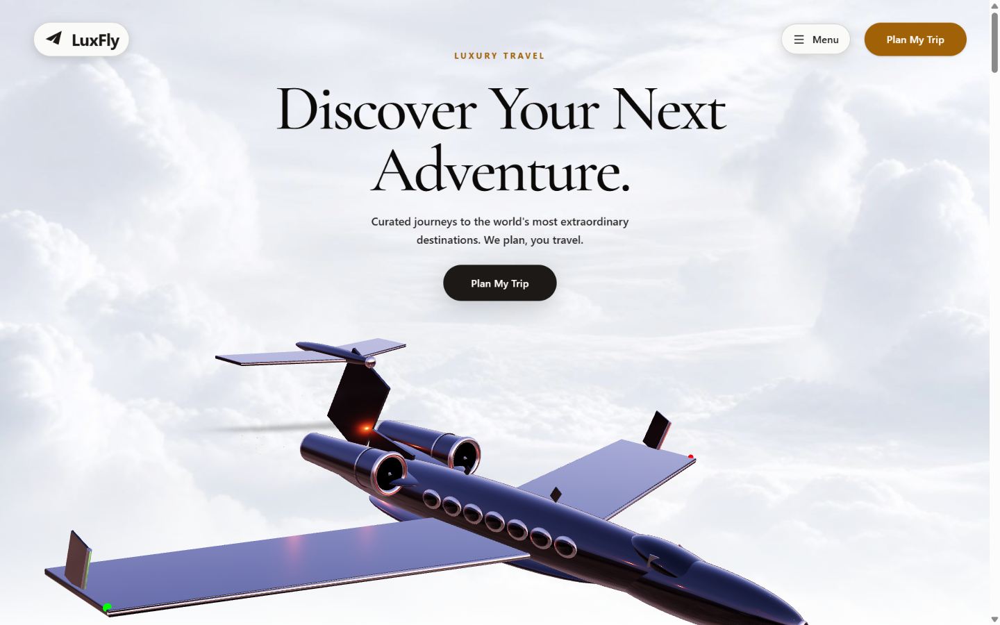

<div align="center">

# LuxFly

### Premium Travel Agency Landing Experience

A cinematic, scroll-driven landing page for a luxury travel agency, featuring a real-time 3D jet model, frame-sequence animations, and an interactive hand-drawn destination sketchbook.



</div>

---

## Overview

LuxFly is a high-end travel agency website built with cutting-edge web technologies. The experience combines a 3D private jet that responds to scroll position, a cinematic frame-sequence window-opening animation, and a tactile sketchbook interface where users can flip through destination illustrations before booking their trip.

## Tech Stack

| Layer | Technology |
|-------|------------|
| Framework | React 19 + TypeScript |
| 3D Engine | Three.js / React Three Fiber |
| Animation | Framer Motion + GSAP-style scroll |
| Styling | Tailwind CSS v4 |
| Fonts | Cormorant Garamond (headings) + Manrope (body) |
| Build | Vite |

## Features

- **3D Jet Model** — Custom-built Gulfstream-style jet with scroll-driven position, rotation, and scale animations
- **Frame Sequence** — 280 WebP images (desktop + mobile) scrubbed via scroll to create a cinematic window-opening effect
- **Interactive Sketchbook** — Standalone HTML/CSS/JS with page-turn physics, magnifying glass, and 6 hand-drawn destination illustrations
- **Responsive Design** — Optimized for mobile (390px), tablet (768px), and desktop (1440px+)
- **Custom Cursor** — Magnetic buttons with spring-physics hover effects
- **Reduced Motion** — Full support for `prefers-reduced-motion`

## Getting Started

**Prerequisites:** Node.js 18+

```bash
# Install dependencies
npm install

# Start dev server (runs on port 3000)
npm run dev
```

## Project Structure

```
src/
  components/
    JetScene.tsx        # 3D canvas, scroll controls, camera
    JetModel.tsx        # Custom jet geometry + materials
    OverlayHTML.tsx     # All 9 HTML sections (hero → CTA)
    FrameSequence.tsx   # WebP frame scrubbing
    CustomCursor.tsx    # Spring-physics cursor
    MagneticButton.tsx  # Touch-friendly magnetic CTA
  hooks/
    useDeviceTier.tsx   # Performance tier detection
public/
  sketchbook/           # Standalone sketchbook app
  frames/               # Desktop + mobile frame sequences
  posters/              # Hero + window-open images
```

## Screenshots

<div align="center">


*Interactive destination sketchbook with hand-drawn illustrations*

</div>

## License

MIT
